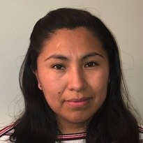
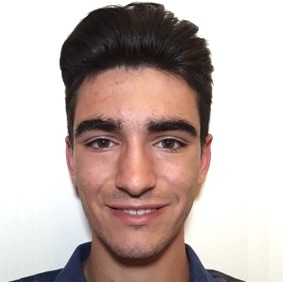
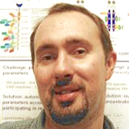
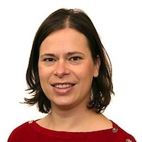

The project was initiated by the European Institute for Systems Biology and Medicine (EISBM) in collaboration with the European Molecular Biology Laboratory, European Bioinformatics Institute (EMBL-EBI). The project team <!--[project team](#project-team)--> includes participants with expertise in systems biomedicine, computational biology, pathway curation and standard formats from research groups in 
France, 
the United Kingdom, 
Luxembourg, 
Norway, 
the Netherlands, 
Germany, 
the United States, 
Russia 
and 
Japan.

# Contact

To join the effort please use this email address:  
[metabolismregulation@googlegroups.com](mailto:metabolismregulation@googlegroups.com)  

Project coordinators:  
Alexander Mazein [a.mazein@gmail.com](mailto:a.mazein@gmail.com)  
Irina Balaur [irina.a.balaur@gmail.com ](mailto:irinaa.balaur@gmail.com)  

# How to contribute

To learn more and to contribute, please review the available [maps](/gallery/), a collection of diagrams in Systems Biology Graphical Notation (SBGN). There is a list of [selected topics](/lists/) that are already in work or being prepared for curation. 

In additon to GraphML and SBGN-ML, we aim to provide maps in various formats including CellDesigner, SBML and BioPAX, so the models are easily accessible and can be downloaded, reused and improved. These formats will be generated automatically.

Ways to contribute: 
* Drawing diagrams: please join the work on one of the existing topics or propose a new one. Diagrams can be drawn using the SBGN palette in the yEd Graph Editor, the main tool in this project. Resulting format: GraphML. Please review tips on [how to draw SBGN diagrams in yEd](/help/). Also, any tool that generates valid SBGN-ML can be used, for example SBGN-ED or Newt Editor, and in that case the files are to be provided in SBGN-ML.
* Proposing new topics: it can be done through direct search on the subject of metabolism regulation or by working with the automatically assembled [lists](/lists/).
* Proposing new [colour schemes](/colours/). We are looking for ways to improve the diagrams aestetically. To experiment with colours and layouts, download any diagram in GraphML format and edit as you prefer. 

<!--# Availability
The Metabolism Regulation maps are available as an open access resource under the terms of the [Creative Commons Public Domain (CC0) License](https://creativecommons.org/publicdomain/zero/1.0/). This applies to map images, downloadable map files and annotation data from maps.-->

# Project team

[Alexander Mazein](#AlexanderMazein), [Irina Balaur](#IrinaBalaur), [Antonio Fabregat](#AntonioFabregat), [Hanna Borlinghaus](#HannaBorlinghaus), [Falk Schreiber](#FalkSchreiber), [Valeriya Berzhitskaya](#ValeriyaBerzhitskaya), [Tatiana Serebriiskaia](#TatianaSerebriiskaia), [Adrien Rougny](#AdrienRougny), [Vasundra Toure](#VasundraToure), [Olga Ivanova](#OlgaIvanova), [James Greene](#JamesGreene), [John Albanese](#JohnAlbanese), [Maria del Carmen Heredia](#MariadelCarmenHeredia), [Michael Blinov](#MichaelBlinov), 
[Marek Ostaszewski](#MarekOstaszewski), [Piotr Gawron](#PiotrGawron), [Frank Bergmann](#FrankBergmann), 
[Hong-Wu Ma](#HongWuMa), [Igor Goryanin](#IgorGoryanin), [Ines Thiele](#InesThiele), [Charles Auffray](#CharlesAuffray), [Reinhard Schneider](#ReinhardSchneider)   

<table>
    <tr>
    <td style="width:120px; text-align:center; font-size:90%; padding-top:0.4em;"></td>
    <td style="width:300px; vertical-align:top; padding-left:0.8em; padding-top:0.4em"><strong>Alexander Mazein</strong> 
Researcher Luxembourg Centre for Systems Biomedicine, University of Luxembourg, Belval, Luxembourg Contribution: Project coordination, <a href="../glycolysis/">Glycolysis</a>, <a href="../glycogen/">Glycogen</a>, <a href="../mevalonate/">Mevalonate</a>, <a href="../eicosanoids/">Eicosanoids</a>, <a href="../inos/">iNOS pathway</a>, <a href="../aspirin/">Aspirin action mechanism</a>
</td>
    <td style="width:120px; text-align:center; font-size:90%; padding-top:0.4em;"></td>
    <td style="width:300px; vertical-align:top; padding-left:0.8em; padding-top:0.4em;"><strong>Irina Balaur</strong> 
Postdoctoral researcher Luxembourg Centre for Systems Biomedicine, University of Luxembourg, Belval, Luxembourg Contribution: Project coordination, Recon2Neo4j, <a href="../lists/">Reactome-Recon lists</a>
</td>
    </tr>
    <tr>
    <td style="width:120px; text-align:center; font-size:90%; padding-top:0.4em;"></td>
    <td style="vertical-align:top; padding-left:0.8em; padding-top:0.4em;"><strong>Antonio Fabregat</strong> 
Senior Software Engineer European Molecular Biology Laboratory, European Bioinformatics Institute (EMBL-EBI), Hinxton, United Kingdom Contribution: Reactome Neo4j, <a href="../lists/">Reactome-Recon lists</a>
</td>
    <td style="width:120px; text-align:center; font-size:90%; padding-top:0.4em;"></td>
    <td style="vertical-align:top; padding-left:0.8em; padding-top:0.4em;"><strong>Adrien Rougny</strong> 
Researcher National Institute of Advanced Industrial Science and Technology, Tokyo, Japan Contibution: <a href="../acly/">Acetyl-CoA synthesis</a>
</td>
    </tr>
    <tr>
    <td style="width:120px; text-align:center; font-size:90%; padding-top:0.4em;"></td>
    <td style="vertical-align:top; padding-left:0.8em; padding-top:0.4em;"><strong>Vasundra Toure</strong> 
PhD Student Norwegian University of Science and Technology, Trondheim, Norway Contribution: <a href="../glycolysis/">Glycolysis</a>, <a href="../glycogen/">Glycogen</a>
</td>
    <td style="width:120px; text-align:center; font-size:90%; padding-top:0.4em;"></td>
    <td style="vertical-align:top; padding-left:0.8em; padding-top:0.4em;"><strong>Hanna Borlinghaus</strong> 
PhD Student University of Konstanz, Konstanz, Germany Contribution: <a href="../estrogen/">Estradiol biosynthesis</a>, <a href="../pyrimidine/">Pyrimidine biosynthesis</a>, <a href="../glutaminase/">Glutaminolysis</a>
</td>
    </tr>
    <tr>
    <td style="width:120px; text-align:center; font-size:90%; padding-top:0.4em;"></td>
    <td style="vertical-align:top; padding-left:0.8em; padding-top:0.4em;"><strong>Falk Schreiber</strong> 
Chair for Life Science Informatics University of Konstanz, Konstanz, Germany Contribution: Resources, <a href="../estrogen/">Estradiol biosynthesis</a>, <a href="../pyrimidine/">Pyrimidine biosynthesis</a>, <a href="../glutaminase/">Glutaminolysis</a>
</td>
    <td style="width:120px; text-align:center; font-size:90%; padding-top:0.4em;"></td>
    <td style="vertical-align:top; padding-left:0.8em; padding-top:0.4em;"><strong>Valeriya Berzhitskaya</strong> 
Researcher Moscow Institute of Physics and Technology, Moscow, Russia Contribution: <a href="../srebp/">Cholesterol</a>, <a href="../glycogen/">Glycogen</a>, <a href="../camp/">cAMP hydrolysis</a>, <a href="../carnitine/">Acyl-carnitine synthesis</a>, <a href="../tag/">Triacylglycerol hydrolysis</a>
</td>
    </tr>
    <tr>
    <td style="width:120px; text-align:center; font-size:90%; padding-top:0.4em;"></td>
    <td style="vertical-align:top; padding-left:0.8em; padding-top:0.4em;"><strong>Tatiana Serebriiskaia</strong> 
Senior Researcher Moscow Institute of Physics and Technology, Moscow, Russia Contribution: Resources, <a href="../srebp/">Cholesterol</a>, <a href="../glycogen/">Glycogen</a>, <a href="../camp/">cAMP hydrolysis</a>, <a href="../carnitine/">Acyl-carnitine synthesis</a>, <a href="../tag/">Triacylglycerol hydrolysis</a>
</td>
    <td style="width:120px; text-align:center; font-size:90%; padding-top:0.4em;"></td>
    <td style="vertical-align:top; padding-left:0.8em; padding-top:0.4em;"><strong>James Greene</strong> 
MSc Student University of Connecticut School of Medicine, Farmington, USA Contribution: <a href="../mevalonate/">Mevalonate</a>, <a href="../phosphoinositides/">Phosphoinositides</a>
</td>
    </tr>
    <tr>
    <td style="width:120px; text-align:center; font-size:90%; padding-top:0.4em;"></td>
    <td style="vertical-align:top; padding-left:0.8em; padding-top:0.4em;"><strong>Maria del Carmen Heredia</strong> 
MSc Student University of Connecticut, Storrs, USA Contribution: Annotation, <a href="../glycolysis/">Glycolysis</a>, <a href="../eicosanoids/">Eicosanoids</a>, <a href="../srebp/">Cholesterol</a>, <a href="../inos/">iNOS pathway</a>, <a href="../carnitine/">Acyl-carnitine synthesis</a>, <a href="../glutaminase/">Glutaminolysis</a>, <a href="../aspirin/">Aspirin action mechanism</a> 
</td>
    <td style="width:120px; text-align:center; font-size:90%; padding-top:0.4em;"></td>
    <td style="vertical-align:top; padding-left:0.8em; padding-top:0.4em;"><strong>John Albanese</strong> 
MSc Student Trinity College, Hartford, USA Contribution: Annotation, <a href="../glycogen/">Glycogen</a>, <a href="../glycogen/">Glycogen</a>, <a href="../acly/">Acetyl-CoA synthesis</a>, <a href="../enos/">eNOS pathway</a>, <a href="../camp/">cAMP hydrolysis</a>, <a href="../tag/">Triacylglycerol hydrolysis</a>, <a href="../estrogen/">Estradiol biosynthesis</a>, <a href="../pyrimidine/">Pyrimidine</a> 
</td>
    </tr>
    <tr>
    <td style="width:120px; text-align:center; font-size:90%; padding-top:0.4em;"></td>
    <td style="vertical-align:top; padding-left:0.8em; padding-top:0.4em;"><strong>Michael Blinov</strong> 
Assistant Professor, Center for Cell Analysis and Modeling University of Connecticut School of Medicine, Farmington, USA Contribution: Resources, <a href="../mevalonate/">Mevalonate</a>, <a href="../phosphoinositides/">Phosphoinositides</a>
</td>
    <td style="width:120px; text-align:center; font-size:90%; padding-top:0.4em;"></td>
    <td style="vertical-align:top; padding-left:0.8em; padding-top:0.4em;"><strong>Olga Ivanova</strong> 
Junior Researcher Amsterdam University Medical Centers, University of Amsterdam, Amsterdam, Netherlands Contribution: <a href="../enos/">eNOS pathway</a>
</td>
    </tr>
    <tr>
    <td style="width:120px; text-align:center; font-size:90%; padding-top:0.4em;"></td>
    <td style="vertical-align:top; padding-left:0.8em; padding-top:0.4em;"><strong>Frank Bergmann</strong> 
Member of Scientific Staff University of Heidelberg, Heidelberg, Germany Contribution: SBGN-ML 0.3 support
</td>
    <td style="width:120px; text-align:center; font-size:90%; padding-top:0.4em;"></td>
    <td style="vertical-align:top; padding-left:0.8em; padding-top:0.4em;"><strong>Piotr Gawron</strong> 
Researcher Luxembourg Centre for Systems Biomedicine, University of Luxembourg, Belval, Luxembourg Contribution: MINERVA support, SBGN-ML import/export support in MINERVA
</td>
    </tr>
    <tr>
    <td style="width:120px; text-align:center; font-size:90%; padding-top:0.4em;"></td>
    <td style="vertical-align:top; padding-left:0.8em; padding-top:0.4em;"><strong>Marek Ostaszewski</strong> 
Research Scientist Luxembourg Centre for Systems Biomedicine, University of Luxembourg, Belval, Luxembourg Contribution: MINERVA support, SBGN-ML import/export support in MINERVA
</td>
    <td style="width:120px; text-align:center; font-size:90%; padding-top:0.4em;"></td>
    <td style="vertical-align:top; padding-left:0.8em; padding-top:0.4em;"><strong>Hong-Wu Ma</strong> 
Professor Tianjin Institute of Industrial Biotechnology, Chinese Academy of Science, Tianjin, China Contribution: Initial discussion, concept development, Recon2 project
</td>
    </tr>
    <tr>
    <td style="width:120px; text-align:center; font-size:90%; padding-top:0.4em;"></td>
    <td style="vertical-align:top; padding-left:0.8em; padding-top:0.4em;"><strong>Igor Goryanin</strong> 
Henrik Kacser Chair in Computational Systems Biology School of Informatics, University of Edinburgh, Edinburgh, United Kingdom Contribution: Initial discussion, concept development, Recon2 project
</td>
    <td style="width:120px; text-align:center; font-size:90%; padding-top:0.4em;"></td>
    <td style="vertical-align:top; padding-left:0.8em; padding-top:0.4em;"><strong>Ines Thiele</strong> 
Professor in Systems Biomedicine National University of Ireland Galway (NUI Galway), Galway, Ireland Contribution: Discussion, project planning, Recon2 project
</td>
    </tr>
    <tr>
    <td style="width:120px; text-align:center; font-size:90%; padding-top:0.4em;"></td>
    <td style="vertical-align:top; padding-left:0.8em; padding-top:0.4em;"><strong>Charles Auffray</strong> 
Research Director at CNRS Founding Director of the EISBM European Institute for Systems Biology and Medicine, Lyon, France Contribution: Support at the EISBM
</td>
    <td style="width:120px; text-align:center; font-size:90%; padding-top:0.4em;"></td>
    <td style="vertical-align:top; padding-left:0.8em; padding-top:0.4em;"><strong>Reinhard Schneider</strong> 
Head of Bioinformatics Core Facility Luxembourg Centre for Systems Biomedicine, University of Luxembourg, Belval, Luxembourg Contribution: Support at the LCSB, MINERVA support
</td>
    </tr>
</table>

 

# Collaborative network

 

<table>
    <tr>
      <td width="260" align="center"></td>
      <td width="260" align="center"></td>
      <td width="260" align="center"></td>
    </tr>
</table>

<!--<td width="320" align="center"></td>-->

 

<table>
    <tr>
      <td style="width:260px;" align="center"></td>
      <td style="width:260px;" align="center"></td>
      <td style="width:260px;" align="center"></td>
    </tr>
</table>

 

<table>
    <tr>
      <td style="width:260px;" align="center"></td>
      <td style="width:260px;" align="center"></td>
      <td style="width:260px;" align="center"></td>
    </tr>
</table>

 

<table>
    <tr>
      <td style="width:260px;" align="center"></td>
      <td style="width:260px;" align="center"> </td>
      <td style="width:260px;" align="center"> </td>
    </tr>
</table>

 

<!--
<td style="width:260px;" align="center"></td>
<td style="width:260px;" align="center"></td>
-->

