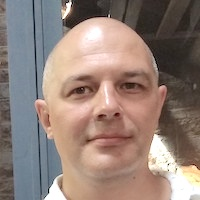
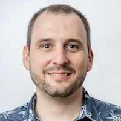
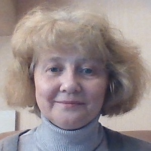
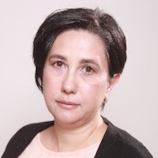
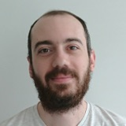
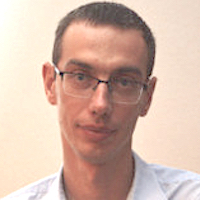
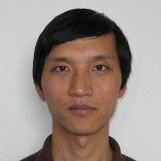
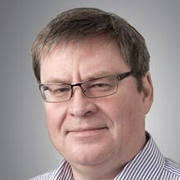
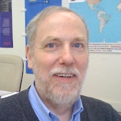

[Alexander Mazein](#AlexanderMazein), [Irina Balaur](#IrinaBalaur), [Antonio Fabregat](#AntonioFabregat), [Hanna Borlinghaus](#HannaBorlinghaus), [Falk Schreiber](#FalkSchreiber), [Valeriya Berzhitskaya](#ValeriyaBerzhitskaya), [Tatiana Serebriiskaia](#TatianaSerebriiskaia), [Adrien Rougny](#AdrienRougny), [Vasundra Toure](#VasundraToure), [Olga Ivanova](#OlgaIvanova), [James Greene](#JamesGreene), [John Albanese](#JohnAlbanese), [Maria del Carmen Heredia](#MariadelCarmenHeredia), [Michael Blinov](#MichaelBlinov), 
[Marek Ostaszewski](#MarekOstaszewski), [Piotr Gawron](#PiotrGawron), [Frank Bergmann](#FrankBergmann), 
[Hong-Wu Ma](#HongWuMa), [Igor Goryanin](#IgorGoryanin), [Ines Thiele](#InesThiele), [Charles Auffray](#CharlesAuffray), [Reinhard Schneider](#ReinhardSchneider)   

<table>
    <tr>
    <td style="width:120px; text-align:center; font-size:90%; padding-top:0.4em;"></td>
    <td style="vertical-align:top; padding-left:0.8em; padding-top:0.4em"><strong>Alexander Mazein</strong> 
Researcher Luxembourg Centre for Systems Biomedicine, University of Luxembourg, Belval, Luxembourg European Institute for Systems Biology and Medicine, Lyon, France Contribution: Project coordination, <a href="../glycolysis/">Glycolysis</a>, <a href="../mevalonate/">Mevalonate</a>, <a href="../eicosanoids/">Eicosanoids</a>, <a href="../inos/">iNOS pathway</a>, <a href="../aspirin/">Aspirin action mechanism</a>
</td>
    </tr>
    <tr>
    <td style="width:120px; text-align:center; font-size:90%; padding-top:0.4em;"></td>
    <td style="vertical-align:top; padding-left:0.8em; padding-top:0.4em;"><strong>Irina Balaur</strong> 
Researcher European Institute for Systems Biology and Medicine, Lyon, France Contribution: Project coordinatioin, Recon2Neo4j, <a href="../lists/">Reactome-Recon lists</a>
</td>
    </tr>
    <tr>
    <td style="width:120px; text-align:center; font-size:90%; padding-top:0.4em;"></td>
    <td style="vertical-align:top; padding-left:0.8em; padding-top:0.4em;"><strong>Antonio Fabregat</strong> 
Reactome Project Coordinator / Senior Software Engineer European Molecular Biology Laboratory, European Bioinformatics Institute (EMBL-EBI), Hinxton, United Kingdom Contribution: Reactome Neo4j, <a href="../lists/">Reactome-Recon lists</a>
</td>
    </tr>
    <tr>
    <td style="width:120px; text-align:center; font-size:90%; padding-top:0.4em;"></td>
    <td style="vertical-align:top; padding-left:0.8em; padding-top:0.4em;"><strong>Valeriya Berzhitskaya</strong> 
Researcher Moscow Institute of Physics and Technology, Moscow, Russia Contribution: <a href="../srebp/">Cholesterol</a>, <a href="../glycogen/">Glycogen</a>, <a href="../camp/">cAMP hydrolysis</a>, <a href="../carnitine/">Acyl-carnitine synthesis</a>, <a href="../tag/">Triacylglycerol hydrolysis</a>
</td>
    </tr>
    <tr>
    <td style="width:120px; text-align:center; font-size:90%; padding-top:0.4em;"></td>
    <td style="vertical-align:top; padding-left:0.8em; padding-top:0.4em;"><strong>Tatiana Serebriiskaia</strong> 
Senior Researcher Moscow Institute of Physics and Technology, Moscow, Russia Contribution: <a href="../srebp/">Cholesterol</a>, <a href="../glycogen/">Glycogen</a>, <a href="../camp/">cAMP hydrolysis</a>, <a href="../carnitine/">Acyl-carnitine synthesis</a>, <a href="../tag/">Triacylglycerol hydrolysis</a>
</td>
    </tr>
    <tr>
    <td style="width:120px; text-align:center; font-size:90%; padding-top:0.4em;"></td>
    <td style="vertical-align:top; padding-left:0.8em; padding-top:0.4em;"><strong>Adrien Rougny</strong> 
Researcher National Institute of Advanced Industrial Science and Technology, Tokyo, Japan Contibution: <a href="../acly/">Acetyl-CoA synthesis</a>
</td>
    </tr>
    <tr>
    <td style="width:120px; text-align:center; font-size:90%; padding-top:0.4em;"></td>
    <td style="vertical-align:top; padding-left:0.8em; padding-top:0.4em;"><strong>Vasundra Toure</strong> 
PhD Student Norwegian University of Science and Technology, Trondheim, Norway Contribution: <a href="../glycolysis/">Glycolysis</a>, <a href="../glycogen/">Glycogen</a>
</td>
    </tr>
    <tr>
    <td style="width:120px; text-align:center; font-size:90%; padding-top:0.4em;"></td>
    <td style="vertical-align:top; padding-left:0.8em; padding-top:0.4em;"><strong>Hanna Borlinghaus</strong> 
PhD Student University of Konstanz, Konstanz, Germany Contribution: <a href="../estrogen/">Estradiol biosynthesis</a>, <a href="../pyrimidine/">Pyrimidine biosynthesis</a>, <a href="../glutaminase/">Glutaminolysis</a>
</td>
    </tr>
    <tr>
    <td style="width:120px; text-align:center; font-size:90%; padding-top:0.4em;"></td>
    <td style="vertical-align:top; padding-left:0.8em; padding-top:0.4em;"><strong>Falk Schreiber</strong> 
Chair for Life Science Informatics University of Konstanz, Konstanz, Germany Contribution: <a href="../estrogen/">Estradiol biosynthesis</a>, <a href="../pyrimidine/">Pyrimidine biosynthesis</a>, <a href="../glutaminase/">Glutaminolysis</a>
</td>
    </tr>
    <tr>
    <td style="width:120px; text-align:center; font-size:90%; padding-top:0.4em;"></td>
    <td style="vertical-align:top; padding-left:0.8em; padding-top:0.4em;"><strong>Frank Bergmann</strong> 
Member of Scientific Staff University of Heidelberg, Heidelberg, Germany Contribution: SBGN-ML 0.3 support
</td>
    </tr>
    <tr>
    <td style="width:120px; text-align:center; font-size:90%; padding-top:0.4em;"></td>
    <td style="vertical-align:top; padding-left:0.8em; padding-top:0.4em;"><strong>Piotr Gawron</strong> 
Researcher Luxembourg Centre for Systems Biomedicine, University of Luxembourg, Belval, Luxembourg Contribution: MINERVA support, SBGN-ML import/export support in MINERVA
</td>
    </tr>
    <tr>
    <td style="width:120px; text-align:center; font-size:90%; padding-top:0.4em;"></td>
    <td style="vertical-align:top; padding-left:0.8em; padding-top:0.4em;"><strong>Marek Ostaszewski</strong> 
Research Scientist Luxembourg Centre for Systems Biomedicine, University of Luxembourg, Belval, Luxembourg Contribution: MINERVA support, SBGN-ML import/export support in MINERVA
</td>
    </tr>
    <tr>
    <td style="width:120px; text-align:center; font-size:90%; padding-top:0.4em;"></td>
    <td style="vertical-align:top; padding-left:0.8em; padding-top:0.4em;"><strong>Hong-Wu Ma</strong> 
Professor Tianjin Institute of Industrial Biotechnology, Chinese Academy of Science, Tianjin, China Contribution: Initial discussion, concept development, Recon2 project
</td>
    </tr>
    <tr>
    <td style="width:120px; text-align:center; font-size:90%; padding-top:0.4em;"></td>
    <td style="vertical-align:top; padding-left:0.8em; padding-top:0.4em;"><strong>Igor Goryanin</strong> 
Henrik Kacser Chair in Computational Systems Biology School of Informatics, University of Edinburgh, Edinburgh, United Kingdom Contribution: Initial discussion, concept development, Recon2 project
</td>
    </tr>
    <tr>
    <td style="width:120px; text-align:center; font-size:90%; padding-top:0.4em;"></td>
    <td style="vertical-align:top; padding-left:0.8em; padding-top:0.4em;"><strong>Charles Auffray</strong> 
Research Director at CNRS Founding Director of the EISBM European Institute for Systems Biology and Medicine, Lyon, France Contribution: Support at the EISBM
</td>
    </tr>
    <tr>
    <td style="width:120px; text-align:center; font-size:90%; padding-top:0.4em;"></td>
    <td style="vertical-align:top; padding-left:0.8em; padding-top:0.4em;"><strong>Reinhard Schneider</strong> 
Full professor / Chief Scientist 1 in Bioinformatics Head of Bioinformatics Core Facility Luxembourg Centre for Systems Biomedicine, University of Luxembourg, Belval, Luxembourg Contribution: Support at the LCSB, MINERVA support
</td>
    </tr>
</table>

 

<table>
    <tr>
      <td style="width:210px;">
 
</td>
      <td style="width:210px;">
 
</td>
      <td style="width:210px;">
 
</td>
      <td style="width:210px;">
 
</td>
    </tr>
</table>
<table>
    <tr>
      <td style="width:210px;">
<strong>Irina Balaur</strong>

European Institute for Systems Biology and Medicine, Lyon, France
</td>
      <td style="width:210px;">
<strong>Alexander Mazein</strong>

Luxembourg Centre for Systems Biomedicine, University of Luxembourg, Belvaux, Luxembourg
</td>
      <td style="width:210px;">
<strong>Charles Auffray</strong>

European Institute for Systems Biology and Medicine, Lyon, France
</td>
      <td style="width:210px;">
<strong>Antonio Fabregat</strong>

European Molecular Biology Laboratory, European Bioinformatics Institute (EMBL-EBI), Hinxton, UK
</td>
    </tr>
</table>

<table>
    <tr>
      <td style="width:210px;">
 
</td>
      <td style="width:210px;">
 
</td>
      <td style="width:210px;">
 
</td>
      <td style="width:210px;">
 
</td>
    </tr>
</table>
<table>
    <tr>
      <td style="width:210px;">
<strong>Adrien Rougny</strong>

National Institute of Advanced Industrial Science and Technology, Tokyo, Japan
</td>
      <td style="width:210px;">
<strong>Vasundra Touré</strong>

Norwegian University of Science and Technology (NTNU), Trondheim, Norway
</td>
      <td style="width:210px;">
<strong>Hanna Borlinghaus</strong>

University of Konstanz, Konstanz, Germany
</td>
      <td style="width:210px;">
<strong>Falk Schreiber</strong>

University of Konstanz, Konstanz, Germany
</td>
    </tr>
</table>

<table>
    <tr>
      <td style="width:210px;">
 
</td>
      <td style="width:210px;">
 
</td>
      <td style="width:210px;">
 
</td>
      <td style="width:210px;">
 
</td>
    </tr>
</table>
<table>
    <tr>
      <td style="width:210px;">
<strong>Olga Ivanova</strong>

Amsterdam University Medical Centers, University of Amsterdam, <!--Vrije Universiteit Amsterdam, -->Amsterdam, Netherlands
</td>
      <td style="width:210px;">
<strong>James Greene</strong>

University of Connecticut School of Medicine, Farmington, USA
</td>
      <td style="width:210px;">
<strong>Michael Blinov</strong>

University of Connecticut School of Medicine, Farmington, USA
</td>
      <td style="width:210px;">
<strong>Tatiana Serebriiskaia</strong>

Moscow Institute of Physics and Technology, Moscow, Russia
</td>
    </tr>
</table>

<table>
    <tr>
      <td style="width:210px;">
 
</td>
      <td style="width:210px;">
 
</td>
      <td style="width:210px;">
 
</td>
      <td style="width:210px;">
 
</td>
    </tr>
</table>

<table>
    <tr>
      <td style="width:210px;">
<strong>Valeriya Berzhitskaya</strong>

Moscow Institute of Physics and Technology, Moscow, Russia
</td>
      <td style="width:210px;">
<strong>Maria Kondratova</strong>

Computational Systems Biology of Cancer, Institut Curie, Paris, France
</td>
      <td style="width:210px;">
<strong>Inna Kuperstein</strong>

Computational Systems Biology of Cancer, Institut Curie, Paris, France
</td>
      <td style="width:210px;">
<strong>Matthias König</strong>

Systems Medicine of the Liver, Humboldt University of Berlin, Germany
</td>
    </tr>
</table>

<table>
    <tr>
      <td style="width:210px;">
 
</td>
      <td style="width:210px;">
 
</td>
      <td style="width:210px;">
 
</td>
      <td style="width:210px;">
 
</td>
    </tr>
</table>

<table>
    <tr>
      <td style="width:210px;">
<strong>Marek Ostaszewski</strong>

Luxembourg Centre for Systems Biomedicine, University of Luxembourg, Belvaux, Luxembourg
</td>
      <td style="width:210px;">
<strong>Reinhard Schneider</strong>

Luxembourg Centre for Systems Biomedicine, University of Luxembourg, Belvaux, Luxembourg
</td>
       <td style="width: 210px;">
<strong>Maria del Carmen  Heredia</strong>

University of Connecticut, Storrs, USA
</td>
        <td style="width: 210px;">
<strong>John Albanese</strong>

Trinity College, Hartford, USA
</td>
</tr>
</table>

<!--
<td style="width:210px;" align="center"><strong>Ines Thiele</strong> Luxembough Centre for Systems Biomedicine, Belval, Luxembourg</td>
<td style="width:210px;" align="center"><strong>Augustin Luna</strong> Dana-Farber Cancer Institute, Harvard Medical School, Boston, USA</td>
<td style="width:210px;" align="center"><strong>Huaiyu Mi</strong> University of Southern California, Keck School of Medicine, Los Angeles, USA</td>
-->

 
